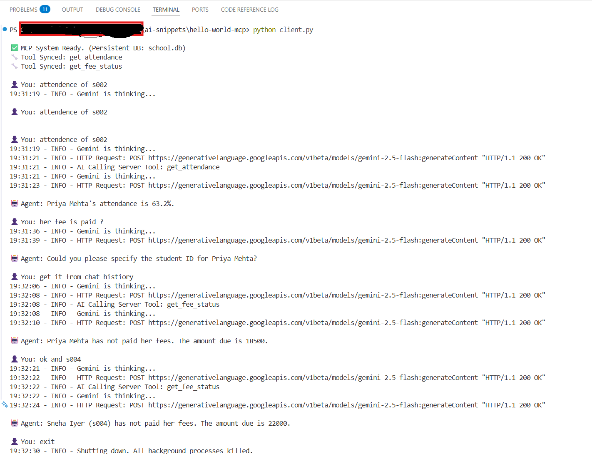

# 🎓 Hello-World-MCP: Persistent AI Agent

This repository contains a functional **Model Context Protocol (MCP)** implementation. It enables a Google Gemini 2.5 Flash AI Agent to interact with a local, persistent SQLite database to manage student records (attendance and fees) through a decoupled client-server architecture.

## 🏗️ Architecture Overview

The system consists of two independent processes communicating via **Standard Input/Output (stdio)** pipes:

1.  **The Server (server.py):** The dedicated **Data Provider**. It initializes and manages a persistent SQLite database (school.db). It uses the FastMCP framework to expose Python functions to the AI as secure, callable "Tools."
2.  **The Client (client.py):** The conversational **Agent "Brain"**. It handles conversation memory, authenticates with the Google Gemini API, and contains a vital schema translation layer that converts standard MCP definitions into the specific OpenAPI format Gemini requires.

---

## 💡 Key Concept: What is async?

As a Data Engineer, the best way to understand async (Asynchronous programming) is to compare it to a single-threaded ETL pipeline vs. an event-driven queue:

* **Synchronous (Sequential):** Your code starts a slow task (like a database query). The entire script **freezes** and waits. It cannot process any other data until the database replies.
* **Asynchronous (async/await):** Your code requests data. Instead of waiting, the async loop pauses that specific function and immediately switches the CPU to handle other tasks (like keeping the chat loop responsive). When the data returns, the loop "wakes up" the original task and finishes it.

---

## 🛠️ The Windows "Gotchas": How we beat the deadlocks

Developing stable stdio pipes on Windows presents specific challenges. This codebase implements four non-obvious fixes to prevent silent hangs:

### 1. The Pipe Buffer Hang (-u)
Windows aggressively buffers pipes to save memory. When the server sends JSON back, Windows "holds" it in a hidden buffer. The client waits forever for data that is trapped in the pipe.
* **The Fix:** We run the server with the -u (Unbuffered) flag: python -u server.py.

### 2. The Proactor Loop
Standard Python asyncio loops on Windows struggle with subprocess pipes.
* **The Fix:** We force the client to use the WindowsProactorEventLoopPolicy to ensure stable communication.

### 3. The DuckDB Pivot (Analytical vs. Application DBs)
* **The Challenge:** We initially built the server using DuckDB. However, DuckDB is an analytical engine (OLAP) with strict C-level thread-safety locks. Because FastMCP executes tools in background worker threads, DuckDB would seize up and cause silent deadlocks on the Windows event loop.
* **The Decision:** Debugging low-level C++ thread locks wasn't the main motive—building a functional MCP agent was. We pragmatically pivoted to SQLite, which is natively built for application workloads (OLTP).
* **The Fix:** We used SQLite with `check_same_thread=False` to safely allow background MCP threads to query the file without crashing the main process.

### 4. Schema Translation (OpenAPI vs JSON)
Gemini requires **OpenAPI** formatting (UPPERCASE types), while MCP provides **JSON Schema** (lowercase types).
* **The Fix:** The client includes a translation loop to bridge this gap: props[k] = {"type": str(v.get("type", "string")).upper()}.

---

## 🚀 Quick Start

### 1. Prerequisites
Ensure you have Python 3.10+ installed. Install the core dependencies via pip:

```bash
pip install mcp google-genai python-dotenv
```

### 2. Environment Setup
Create a `.env` file in the project root and add your API key:

```env
GEMINI_API_KEY=your_actual_key_here
```

### 3. Execution
To start the system, run the client script. It will automatically spawn the server as a background subprocess and initialize the SQLite database file:

```bash
python client.py
```

---


## 📂 File Breakdown & Responsibilities

### 1. `server.py` (The Data Provider)
- **Role:** Handles all database operations.
- **Key Feature:** Uses `FastMCP` to wrap standard Python functions as AI-ready tools.
- **Threading:** Uses `sqlite3` with `check_same_thread=False` to allow the background MCP worker threads to access the database file without deadlocking the main loop.

### 2. `client.py` (The AI Agent)
- **Role:** Manages the user interface and AI reasoning.
- **Key Feature:** Contains the **Schema Translation** loop. It dynamically converts the server's tool definitions into the **uppercase OpenAPI** format required by the Google Gemini API.
- **Networking:** Uses the `-u` flag to launch the server in unbuffered mode, ensuring real-time data flow between processes.

---

## 📝 Example Interaction

The following conversation demonstrates the agent's ability to maintain state from chat history, handle complex pivots, and execute a clean shutdown.


* **You:** "attendance of s002"
* **AI Action:** *Calls `get_attendance(student_id='s002')`*
* **Result:** "Priya Mehta's attendance is 63.2%."

* **You:** "her fee is paid ?"
* **AI Action:** *AI recognizes context but asks for clarification*
* **Result:** "Could you please specify the student ID for Priya Mehta?"

* **You:** "get it from chat history"
* **AI Action:** *AI searches history -> Calls `get_fee_status(student_id='s002')`*
* **Result:** "Priya Mehta has not paid her fees. The amount due is 18500."

* **You:** "ok and s004"
* **AI Action:** *AI pivots to new ID while keeping the "fee status" intent -> Calls `get_fee_status(student_id='s004')`*
* **Result:** "Sneha Iyer (s004) has not paid her fees. The amount due is 22000."

* **You:** "exit"
* **System Action:** *Shutting down and cleaning up processes.*
* **Result:** [Process Exited Successfully]

---

## 🛑 Shutdown & Cleanup

Type `exit` or `quit` to trigger a graceful shutdown. This ensures the client closes the background process, releases the SQLite file locks, and terminates the session cleanly.

---

### 🛡️ Security Note
**Never commit your `.env` file.** If your API keys are ever visible in a screenshot or log, revoke and regenerate them immediately in the Google AI Studio console.

---

### 💡 Pro-Tip
If you want to view or edit the data manually, you can open the `school.db` file using any SQLite browser. The AI will immediately see any changes you make to the rows the next time you ask a question.